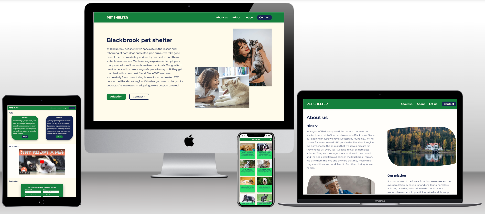
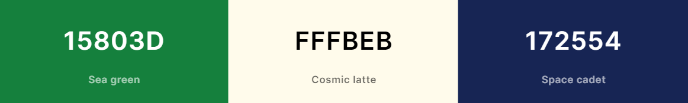

# Pet shelter revamped

View live version of the website [here](https://pet-shelter-revamped-9ae12c6ada43.herokuapp.com/).

This website is a revamped version of [my original first milestone project](https://github.com/Larkinz/pet-shelter-project) for the Code Institute course.

This revamp was mainly done to test my improvements in HTML, CSS, and UI/UX design.

---

## Contents

- [**User Experience Design (UXD)**](#user-experience-design-uxd)

  - [Strategy](#strategy)
    - Goal
    - User stories
  - [Scope](#scope)
    - Functional specifications
    - Content requirements
  - [Structure](#structure)
    - Information architecture
    - Interaction design
  - [Skeleton](#skeleton)
    - Wireframes
  - [Surface](#surface)
    - Colours
    - Typography
    - Uniformity

- [**Features**](#features)

  - Existing features
  - Future features

- [**Technologies**](#technologies)

  - Languages
  - Frameworks
  - Libraries
  - Software

- [**Testing**](#testing)

- [**Deployment**](#deployment)

  - Hosting online
  - Running locally

- [**Credits**](#credits)

  - Code
  - Text
  - Media
  - Miscellaneous
  - Acknowledgements

- [**Notes**](#notes)

---

## User experience design (UXD)

### Strategy

#### Goal

#### User stories

### Scope

#### Functional specifications

#### Content requirements

### Structure

#### Information architecture

#### Interaction design

### Skeleton

#### Wireframes

I've made a rough wireframe just to have a visual reminder of the new layout for the main page. To see the wireframe click [here](wireframes/main_layout.png).

### Surface

#### Colours

Improving on the previous colour scheme was necessary for better colour contrast. I've picked colours from the [Tailwind CSS colour palette](https://tailwindcss.com/docs/customizing-colors), making sure for the dark and light colours to have the required minimum contrast score of 4.5 using the [Coolors contrast checker](https://coolors.co/contrast-checker/fffbeb-15803d).

The main colours I've chosen are: Green 700, Amber 50, and Blue 950.

#### Typography

#### Uniformity

**_[Back to top](#contents)_**

---

## Features

### Existing features

#### General features

#### Page specific features

### Future features

**_[Back to top](#contents)_**

---

## Technologies

### Languages

### Frameworks

### Libraries

### Software

**_[Back to top](#contents)_**

---

## Testing

**_[Back to top](#contents)_**

---

## Deployment

### Hosting online

### Running locally

**_[Back to top](#contents)_**

---

## Credits

### Code

### Text

### Media

### Miscellaneous

**_[Back to top](#contents)_**

---

## Notes

**_[Back to top](#contents)_**

---
